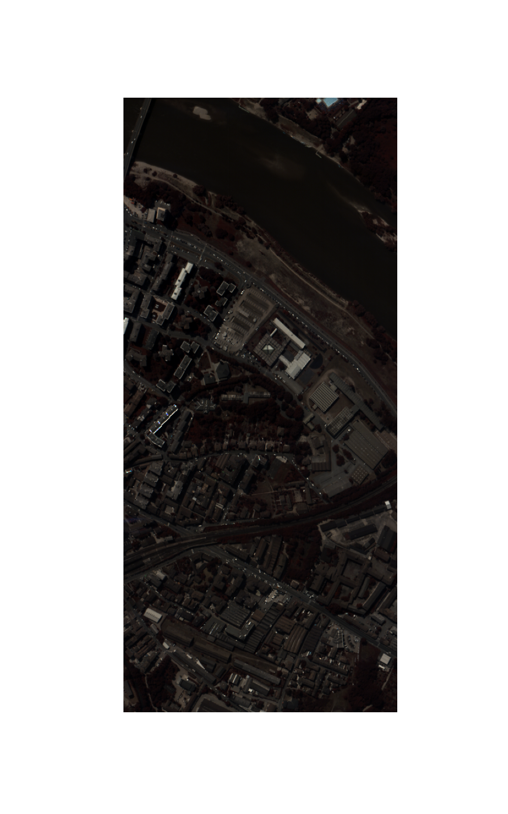
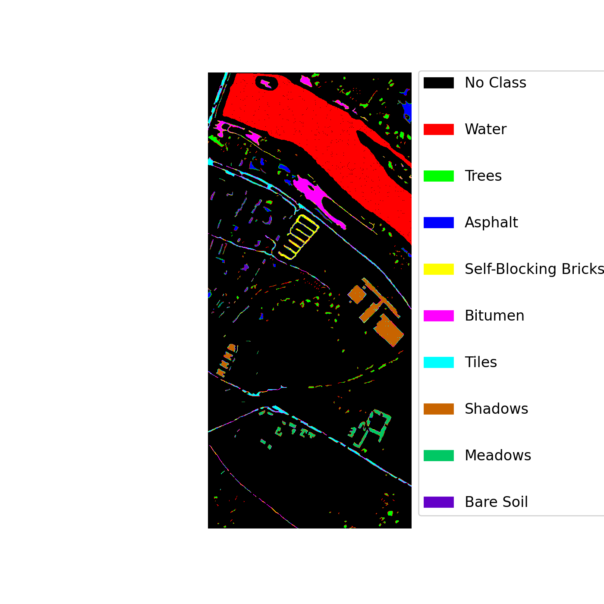
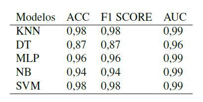

# APLICAÇÃO DE APRENDIZAGEM DE MÁQUINA PARA CLASSIFICAÇÃO DE IMAGEM HIPERESPECTRAL NO DOMÍNIO ESPECTRAL.

## Description

The  aim to develop five supervisioned machine learning algorithms to classify the a hyperspectral image objects based on it's spectral reponse or espectral signature.

## Results

### Pavia Centre Scene dataset

Scene acquired by the ROSIS sensor during a flight campaign over Pavia, nothern Italy. The number of spectral bands is 102. The two figures show the it´s pseudocolor and groundtruth

  

### Results
The table sumarize the accuracy, f1-score and AUC for each method after a nested CV for hyperparamets optimization using GridSearchCV and 10-fold cross-validation

